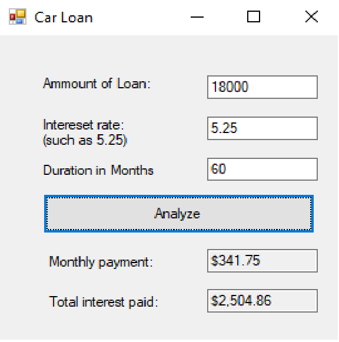

# Module1_Assignment2
Jennifer\
VB.net class project Module 2 assignment 1

# Analysis of the problem
1.	Write a program to analyze a car loan.  The user should enter the amount of the loan, the annual percentage rate of interest, and the loan duration in months. Upon clicking the analyze button, the input should be validated.  If the input is not valid, the user should be notified.  If the Input is valid, the monthly payment and the total interest paid over the life of the loan should be displayed.  
2.	The look and feel of the form are provided.  The text property value for the form, the five labels, and the button are provided.  The formula for calculating monthly payment and the formula for calculating the total interest paid over the life of the loan are provided.  
3.	When the “Analyze” button is clicked, the input should be validated and the monthly payment and total interest paid should be displayed.  Include ‘$’ signs and decimal points for dollar figures.

# Algorithm
1.	Create a form with the text property set to “Car Loan”
2.	Create five labels on the form with the text properties set accordingly to “Amount of Loan:”, “Interest rate: (such as 5.25)”, “Duration in months:”, “Monthly payment:” and “Total interest paid:”
3.	Create a blank text box for inputting text next to each of the following labels:  “Amount of Loan:”, “Interest rate: (such as 5.25)”, “Duration in months:”
5.	Create a read-only text box for displaying data next to each of the following labels:  “Monthly payment:” and “Total interest paid:”
6.	Create a button with the text property set to “Analyze”.  The button should be under the three input textboxes and above the two read-only textboxes.
7.	When the analyze button is clicked, validate the user input
8.	If the input is valid, then calculate the monthly payment and calculate the interest paid over the life of the loan.
9.	The monthly payment is calculated by
10.	Getting the user input principal, interest rate divided by 100 (to convert percentage to decimal), and number of months
11.	monthly payment=  (principal*((interest rate)/12))/(1- 〖(1+ (interest rate)/12)〗^(-number of months) )
12.	The total interest paid over the life of the loan is calculated by
13.	Getting the user input principal, interest rate divided by 100 (to convert percentage to decimal), and number of months
14.	Calculate the monthly payment and then with that value calculate the total interest paid.
15.	Total Interest Paid=number of Months*[MonthlyPayment]-principal
16.	Format the monthly payment and total interest paid as dollar values
17.	Output the monthly payment and total interest paid over the life of the loan to the corresponding read-only textboxes

# Program Demo
